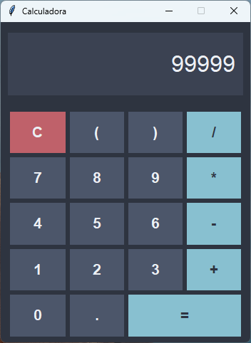

Calculadora em Python (Interface Gráfica)



Uma aplicação desktop simples e elegante de calculadora, construída com Python e a biblioteca gráfica `tkinter`.

Lista de funcionalidades:

- Operações matemáticas básicas (Adição, Subtração, Multiplicação, Divisão).
- Interface moderna com tema dark.
- Tratamento nativo de erros (como divisão por zero).

Tecnologias Utilizadas

- **[Python](https://www.python.org/)** — Linguagem base.
- **[Tkinter](https://docs.python.org/3/library/tkinter.html)** — Interface gráfica nativa.

Como Executar o Projeto:

- Após baixar o projeto, você pode abrir com o Visual Studio Code. Para o projeto funcionar você deve ter configurado no seu PC:

Python >= 3.10.5

Agora, na pasta do projeto abra um terminal e execute:
```bash
python calculadora-python.py